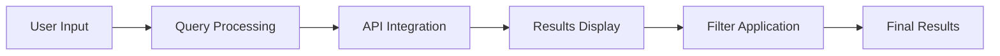

# Research-Paper-Search-Engine
Website for searching for relevant research papers.
# 📚 Research Paper Search Engine


A modern, responsive web application for searching academic research papers across multiple databases with an intuitive interface and powerful filtering capabilities.

## ✨ Live Demo

🔗 **[Try it Live on Vercel](https://research-paper-search.vercel.app)**

## 🎯 Features

### 🔍 **Advanced Search**
- Multi-database search (arXiv, PubMed, IEEE, Crossref)
- Real-time search with instant results
- Boolean search support (AND, OR, NOT)
- Field-specific searching (title, author, abstract)

### 🎛️ **Smart Filtering**
- Publication year range filtering
- Multiple database selection
- Sort by relevance, date, or citation count
- Live filter tags with quick removal

### 📱 **Modern UI/UX**
- Clean, responsive design with large typography
- Dark/light theme ready
- Paper cards with hover effects
- Modal-based detailed view
- Mobile-optimized interface

### 📊 **Paper Management**
- View detailed paper information
- Direct PDF access
- DOI copying with one click
- Export options (CSV, BibTeX - coming soon)
- Search history tracking

## 🏗️ Architecture

```
📁 Research-Paper-Search-Engine/
├── 📄 index.html          # Main HTML structure
├── 🎨 style.css           # Enhanced CSS styling
├── ⚡ script.js           # Core JavaScript logic
└── 📄 README.md          # This documentation
```

## 🚀 Quick Start

### Prerequisites
- Modern web browser (Chrome, Firefox, Safari, Edge)
- Basic understanding of web development (for customization)

### Local Development
1. **Clone the repository**
   ```bash
   git clone https://github.com/Vishwajeet-2005/Research-Paper-Search-Engine.git
   cd Research-Paper-Search-Engine
   ```

2. **Open the project**
   Simply open `index.html` in your browser, or use a local server:
   ```bash
   # Using Python
   python -m http.server 8000
   
   # Using Node.js with http-server
   npx http-server .
   ```

3. **Start searching**
   - Open `http://localhost:8000` in your browser
   - Enter a research topic or keywords
   - Apply filters as needed
   - Click on papers for detailed view

## 🛠️ How It Works

### 1. **Search Flow**


### 2. **API Integration**
The application is designed to integrate with multiple academic APIs:

| Database | API Status | Rate Limits | Key Required |
|----------|------------|-------------|--------------|
| **arXiv** | ✅ Ready | None | No |
| **PubMed** | ⚙️ Planned | 3 requests/sec | No |
| **CrossRef** | ⚙️ Planned | Polite use policy | Email |
| **IEEE Xplore** | ⚙️ Planned | Varies | Yes |
| **OpenAlex** | ⚙️ Planned | 100k/month | No |

### 3. **Mock Data System**
For development and demonstration, the app includes:
- Realistic paper generation based on search queries
- Simulated API responses
- Configurable delay for realistic loading

## 🔧 Customization

### Changing Colors
Edit the CSS variables in `style.css`:
```css
:root {
    --primary-color: #2563eb;
    --secondary-color: #7c3aed;
    /* Customize other variables */
}
```

### Adding New APIs
Extend the `searchRealAPIs` function in `script.js`:
```javascript
async function searchNewAPI(query) {
    const response = await fetch(
        `https://api.new-academic-service.com/search?q=${query}`
    );
    return await response.json();
}
```

### Modifying Layout
- Card structure: `.paper-card` class
- Search box: `.search-input-group`
- Filters: `.filter-group` classes
- Modal: `#paperModal`

## 📱 Responsive Design

The application is fully responsive across all devices:

| Device | Breakpoint | Features |
|--------|------------|----------|
| **Desktop** | > 1200px | Full grid layout, expanded filters |
| **Tablet** | 768px - 1199px | Stacked filters, medium cards |
| **Mobile** | < 768px | Single column, touch-friendly buttons |

## 🔌 API Integration Guide

### Current Mock Implementation
The app currently uses mock data. To connect real APIs:

1. **Enable arXiv API** (No key required):
   ```javascript
   // Uncomment in script.js
   async function searchArXiv(query) {
       const response = await fetch(
           `https://export.arxiv.org/api/query?search_query=all:${query}&max_results=10`
       );
       // Parse XML response
   }
   ```

2. **Add API Keys** (for production):
   Create a `config.js` file:
   ```javascript
   const API_KEYS = {
       CROSSREF_EMAIL: 'your-email@example.com',
       SEMANTIC_SCHOLAR: 'your-api-key-here'
   };
   ```

## 📈 Performance Features

- **Lazy Loading**: Images and content load as needed
- **Caching**: Search results cached in localStorage
- **Debounced Search**: Prevents excessive API calls
- **Minimal Dependencies**: No external libraries required
- **Optimized Assets**: Efficient CSS and JavaScript

## 🧪 Testing

### Manual Testing Checklist
- [ ] Search functionality with various queries
- [ ] Filter application and removal
- [ ] Mobile responsiveness
- [ ] Paper modal display
- [ ] PDF link functionality
- [ ] Copy DOI feature
- [ ] Pagination navigation
- [ ] Browser compatibility

### Browser Support
- ✅ Chrome 90+
- ✅ Firefox 88+
- ✅ Safari 14+
- ✅ Edge 90+
- ✅ Mobile browsers

## 🚀 Deployment

### Deploy on Vercel (Recommended)
1. Fork this repository
2. Go to [vercel.com](https://vercel.com)
3. Click "New Project"
4. Import your GitHub repository
5. Set project name (must be lowercase, e.g., `research-paper-search`)
6. Click "Deploy"

### Deploy on GitHub Pages
1. Push to `gh-pages` branch:
   ```bash
   git subtree push --prefix . origin gh-pages
   ```
2. Enable GitHub Pages in repository settings
3. Access at: `https://yourusername.github.io/Research-Paper-Search-Engine`

## 🤝 Contributing

We welcome contributions! Here's how:

1. **Fork** the repository
2. **Create** a feature branch:
   ```bash
   git checkout -b feature/amazing-feature
   ```
3. **Commit** your changes:
   ```bash
   git commit -m 'Add amazing feature'
   ```
4. **Push** to the branch:
   ```bash
   git push origin feature/amazing-feature
   ```
5. **Open** a Pull Request

### Development Guidelines
- Follow existing code style
- Add comments for complex logic
- Update documentation as needed
- Test on multiple browsers

## 📋 Roadmap

### 🟢 Completed
- [x] Basic search interface
- [x] Mock data system
- [x] Responsive design
- [x] Paper details modal
- [x] Filter system

### 🟡 In Progress
- [ ] Real arXiv API integration
- [ ] Search history feature
- [ ] Export functionality

### 🔴 Planned
- [ ] User accounts
- [ ] Saved papers library
- [ ] Citation generator
- [ ] Advanced analytics
- [ ] More API integrations
- [ ] Dark mode toggle
- [ ] Offline capability

## 🐛 Troubleshooting

### Common Issues

1. **Search not working**
   - Check JavaScript console for errors
   - Verify internet connection
   - Clear browser cache

2. **Layout issues**
   - Check CSS loading
   - Verify viewport meta tag
   - Test in different browsers

3. **API integration fails**
   - Check CORS headers
   - Verify API key/email
   - Review rate limits

### Debug Mode
Enable debug logging in browser console:
```javascript
localStorage.setItem('debug', 'true');
```

## 📄 License

This project is licensed under the MIT License - see the [LICENSE](LICENSE) file for details.

## 🙏 Acknowledgments

- Academic databases for providing API access
- Contributors and testers
- Open source community for inspiration
- Font Awesome for icons
- Google Fonts for typography

## 📞 Support

For support, feature requests, or bug reports:
1. 📧 **Email**: vishwajeetsurvase28@gmail.com
2. 🐛 **Issues**: [GitHub Issues](https://github.com/Vishwajeet-2005/Research-Paper-Search-Engine/issues)
3. 💬 **Discussion**: [GitHub Discussions](https://github.com/Vishwajeet-2005/Research-Paper-Search-Engine/discussions)

## 🌟 Show Your Support

If you find this project useful:
- ⭐ **Star** the repository
- 🍴 **Fork** it for your own use
- 🐛 **Report** bugs and issues
- 💡 **Suggest** new features

---

**Built with ❤️ by Vishwajeet** | [GitHub](https://github.com/Vishwajeet-2005) | [Live Demo](https://research-paper-search.vercel.app)

---

<div align="center">
  
### 🚀 Ready to Search?
[](https://vercel.com/new/clone?repository-url=https%3A%2F%2Fgithub.com%2FVishwajeet-2005%2FResearch-Paper-Search-Engine)
[](https://research-paper-search.vercel.app)

</div>
